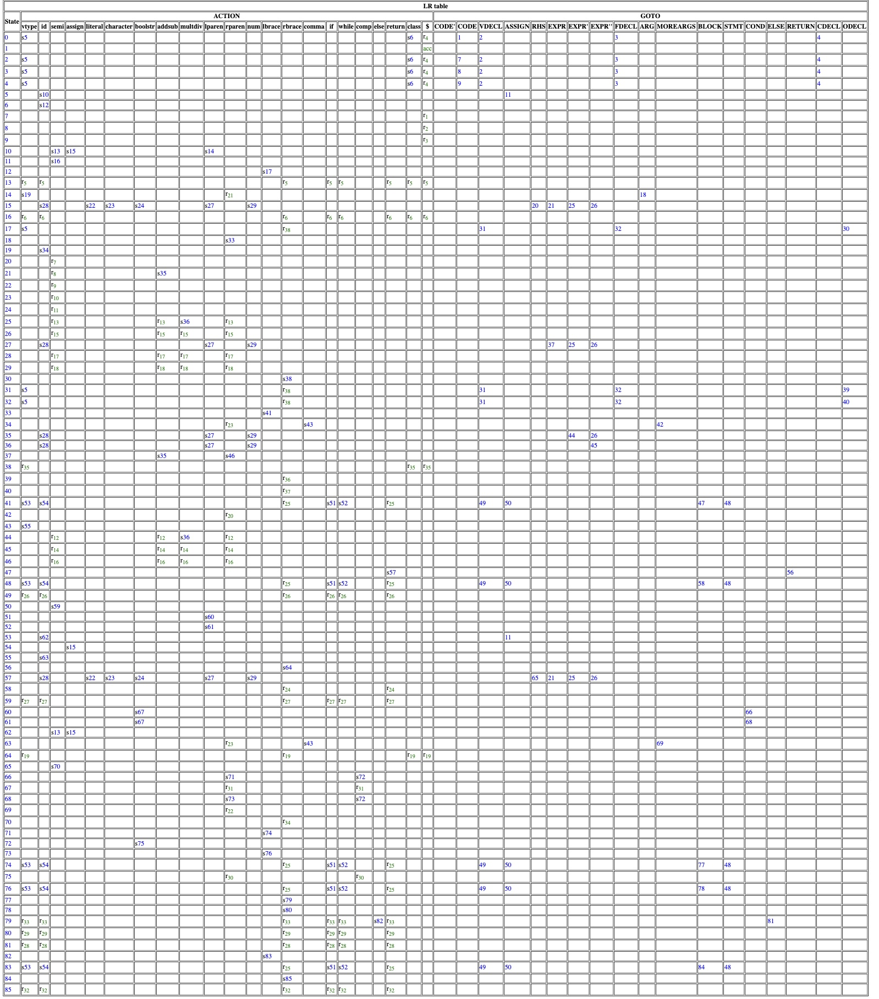

# simple-java-parser
2023-1 Compiler Assignment: Making Parser for Simple Java  
team_id: 67

## Todo
- 코드에 주석 달기
- 문서 pdf로 변환하기

## 실행
```bash
$ ./syntax_analyzer testcase/sample_input0.sj
[1/4] File name: testcase/sample_input0.sj

[2/4] File contents:
vtype id semi

[3/4] Read tokens:
[Vtype Id Semi EOL]

[4/4] Parse tree:
CODE
├── VDECL
│   ├── Vtype
│   ├── Id
│   └── Semi
└── CODE

Accepted!
```
## build
```bash
# rust 설치 (https://www.rust-lang.org/learn/get-started)
$ curl --proto '=https' --tlsv1.2 -sSf https://sh.rustup.rs | sh
# 컴파일
$ cargo build --release
$ cp target/release/simple-java-parser syntax_analyzer
# 실행
$ ./syntax_analyzer testcase/sample_input0.sj
```
## 수정된 CFG
```
00: CODE' -> CODE
01: CODE -> VDECL CODE
02: CODE -> FDECL CODE
03: CODE -> CDECL CODE
04: CODE -> ''
05: VDECL -> vtype id semi
06: VDECL -> vtype ASSIGN semi
07: ASSIGN -> id assign RHS
08: RHS -> EXPR
09: RHS -> literal
10: RHS -> character
11: RHS -> boolstr
12: EXPR -> EXPR addsub EXPR'
13: EXPR -> EXPR'
14: EXPR' -> EXPR' multdiv EXPR''
15: EXPR' -> EXPR''
16: EXPR'' -> lparen EXPR rparen
17: EXPR'' -> id
18: EXPR'' -> num
19: FDECL -> vtype id lparen ARG rparen lbrace BLOCK RETURN rbrace
20: ARG -> vtype id MOREARGS
21: ARG -> ''
22: MOREARGS -> comma vtype id MOREARGS
23: MOREARGS -> ''
24: BLOCK -> STMT BLOCK
25: BLOCK -> ''
26: STMT -> VDECL
27: STMT -> ASSIGN semi
28: STMT -> if lparen COND rparen lbrace BLOCK rbrace ELSE
29: STMT -> while lparen COND rparen lbrace BLOCK rbrace
30: COND -> COND comp boolstr
31: COND -> boolstr
32: ELSE -> else lbrace BLOCK rbrace
33: ELSE -> ''
34: RETURN -> return RHS semi
35: CDECL -> class id lbrace ODECL rbrace
36: ODECL -> VDECL ODECL
37: ODECL -> FDECL ODECL
38: ODECL -> ''
```
## parsing table

